<!-- Copyright 2000-2024 JetBrains s.r.o. and contributors. Use of this source code is governed by the Apache 2.0 license. -->

# 线程模型

<!-- short link: https://jb.gg/ij-platform-threading -->

<link-summary>用于读取和写入 IntelliJ Platform 数据模型、运行和取消后台进程以及避免 UI 冻结的线程规则。</link-summary>

> 强烈建议不熟悉 Java 线程的读者在阅读本节之前先学习官方的 [Java 并发](https://docs.oracle.com/javase/tutorial/essential/concurrency/index.html) 教程。

IntelliJ Platform 是一个高度并发的环境。代码在多个线程中同时执行。一般来说，与常规的 [Swing](https://docs.oracle.com/javase%2Ftutorial%2Fuiswing%2F%2F/index.html) 应用程序一样，线程可以分为两大类：
- [事件分发线程](https://docs.oracle.com/javase/tutorial/uiswing/concurrency/dispatch.html) (EDT) —— 也称为 UI 线程。它的主要目的是处理 UI 事件（例如响应按钮点击或更新 UI），但平台也使用它来写入数据。EDT 从事件队列中取出事件并执行。在 EDT 上执行的操作必须尽可能快，以免阻塞队列中的其他事件并导致 UI 冻结。运行的应用程序中只有一个 EDT。
- 后台线程 (BGT) —— 用于执行长时间运行和耗时的操作或后台任务。

可以在 BGT 和 EDT 之间双向切换。可以通过 `invokeLater()` 方法从 BGT（和 EDT）调度操作在 EDT 上执行（详见本页其余部分）。通过 [后台进程](background_processes.md) 可以从 EDT 切换到 BGT 执行操作。

> 针对 2024.1+ 版本的插件应使用 [协程调度器](coroutine_dispatchers.md) 来切换线程。
>
{style="warning"}

## 读写锁 {id=read-write-lock}

IntelliJ Platform 的数据结构（例如 [程序结构接口](psi.md)、[虚拟文件系统](virtual_file_system.md) 或 [项目根模型](project_model.md)）不是线程安全的。
访问它们需要一种同步机制，以确保所有线程都能看到一致且最新的数据状态。
这是通过一个应用程序范围的 [读写锁 (RW)](https://w.wiki/7dBy) 实现的，线程在读取或写入数据模型时必须获取该锁。

如果一个线程需要访问数据模型，它必须获取以下锁之一：

<table>
    <tr>
        <td width="33%">读锁</td>
        <td width="33%">写意向锁</td>
        <td width="33%">写锁</td>
    </tr>
    <tr>
        <td>允许线程读取数据。</td>
        <td>允许线程读取数据并可能升级为写锁。</td>
        <td>允许线程读取和写入数据。</td>
    </tr>
    <tr>
        <td>可以从任何线程获取，与其他读锁和写意向锁并发。</td>
        <td>可以从任何线程获取，与读锁并发。</td>
        <td>只能从 EDT 获取，与在 EDT 上获取的写意向锁并发。</td>
    </tr>
    <tr>
        <td>如果写锁被另一个线程持有，则无法获取。</td>
        <td>如果另一个写意向锁或写锁被另一个线程持有，则无法获取。</td>
        <td>如果另一个线程持有任何其他锁，则无法获取。</td>
    </tr>
</table>

> 查看 [原因](#why-can-write-intent-lock-be-acquired-from-any-thread-but-write-lock-only-from-edt) 了解为什么允许从任何线程获取写意向锁，而写锁只能从 EDT 获取。

下表以简化的形式展示了锁之间的兼容性：

<table style="both">
    <tr>
        <td width="25%"></td>
        <td width="25%">读锁</td>
        <td width="25%">写意向锁</td>
        <td width="25%">写锁</td>
    </tr>
    <tr>
        <td>读锁</td>
        <td></td>
        <td></td>
        <td></td>
    </tr>
    <tr>
        <td>写意向锁</td>
        <td></td>
        <td></td>
        <td></td>
    </tr>
    <tr>
        <td>写锁</td>
        <td></td>
        <td></td>
        <td></td>
    </tr>
</table>

上述锁的特性可以总结如下：
- 多个线程可以同时读取数据
- 一旦一个线程获取了写锁，其他线程将无法读取或写入数据

在代码中显式获取和释放锁会显得冗长且容易出错，插件绝不应这样做。IntelliJ Platform 在 EDT 上隐式启用了写意向锁（详见 [](#locks-and-edt)），并提供了 [用于在读取或写入锁下访问数据的 API](#accessing-data)。

### 锁与 EDT {id=locks-and-edt}

尽管理论上可以从任何线程获取所有类型的锁，但平台隐式获取写意向锁，并且只允许在 EDT 上获取写锁。
这意味着 **写入数据只能在 EDT 上进行**。

> 众所周知，仅在 EDT 上写入数据可能会导致 UI 冻结的负面后果。
> 目前正在进行一项工作以 [允许从任何线程写入数据](https://youtrack.jetbrains.com/issue/IJPL-53)。
> 有关当前平台版本中此行为的 [历史原因](#why-write-actions-are-currently-allowed-only-on-edt)，请参阅相关说明。

在 EDT 上隐式获取写意向锁的范围因平台版本而异：

<tabs group="threading">

<tab title="2023.3+" group-key="newThreading">

当在 EDT 上使用 [`Application.invokeLater()`](%gh-ic%/platform/core-api/src/com/intellij/openapi/application/Application.java) 调用操作时，写意向锁会自动获取。

</tab>

<tab title="更早版本" group-key="oldThreading">

当在 EDT 上使用以下方法调用操作时，写意向锁会自动获取：
- [`Application.invokeLater()`](%gh-ic%/platform/core-api/src/com/intellij/openapi/application/Application.java),
- [`SwingUtilities.invokeLater()`](https://docs.oracle.com/javase/8/docs/api/javax/swing/SwingUtilities.html#invokeLater-java.lang.Runnable-),
- [`UIUtil.invokeAndWaitIfNeeded()`](%gh-ic%/platform/util/ui/src/com/intellij/util/ui/UIUtil.java),
- [`EdtInvocationManager.invokeLaterIfNeeded()`](%gh-ic%/platform/util/src/com/intellij/util/ui/EdtInvocationManager.java),
- 以及其他类似方法

如果操作需要写入数据，建议使用 `Application.invokeLater()`。对于纯 UI 操作，请使用其他方法。

</tab>

</tabs>

## 访问数据 {id=accessing-data}

IntelliJ Platform 提供了一个简单的 API，用于以读取和写入操作的形式在读取或写入锁下访问数据。

读取和写入操作允许在锁下执行一段代码，自动在操作开始前获取锁，并在操作完成后释放锁。

> 始终尝试将仅需要的操作包装到读取/写入操作中，以最小化持有锁的时间。
> 如果读取操作本身较长，请考虑使用 [读取操作可取消性技术](#read-action-cancellability) 之一，以避免阻塞写锁和 EDT。
>
{style="warning" title="最小化锁定范围"}

### 读取操作 {id=read-actions}

#### API
{#read-actions-api}

- [`ReadAction`](%gh-ic%/platform/core-api/src/com/intellij/openapi/application/ReadAction.java) `run()` 或 `compute()`：
  <tabs group="languages">
  <tab title="Kotlin" group-key="kotlin">

  ```kotlin
  val psiFile = ReadAction.compute<PsiFile, Throwable> {
    // 读取并返回 PsiFile
  }
  ```
  </tab>
  <tab title="Java" group-key="java">

  ```java
  PsiFile psiFile = ReadAction.compute(() -> {
    // 读取并返回 PsiFile
  });
  ```
  </tab>
  </tabs>

##### 替代 API {id=read-action-alternative-apis collapsible=true default-state=collapsed}

- [`Application.runReadAction()`](%gh-ic%/platform/core-api/src/com/intellij/openapi/application/Application.java)：
  <tabs group="languages">
  <tab title="Kotlin" group-key="kotlin">

  ```kotlin
  val psiFile = ApplicationManager.application.runReadAction {
    // 读取并返回 PsiFile
  }
  ```
  </tab>
  <tab title="Java" group-key="java">

  ```java
  PsiFile psiFile = ApplicationManager.getApplication()
      .runReadAction((Computable<PsiFile>)() -> {
        // 读取并返回 PsiFile
      });
  ```
  </tab>
  </tabs>
  请注意，此 API 被视为低级 API，应避免使用。

- Kotlin [`runReadAction()`](%gh-ic%/platform/core-api/src/com/intellij/openapi/application/actions.kt)：
  ```kotlin
  val psiFile = runReadAction {
    // 读取并返回 PsiFile
  }
  ```
  请注意，此 API 自 2024.1 版本起已过时。
  使用 Kotlin 实现并针对 2024.1+ 版本的插件应使用挂起函数 [`readAction()`](%gh-ic%/platform/core-api/src/com/intellij/openapi/application/coroutines.kt)。
  另请参阅 [](coroutine_read_actions.topic)。

#### 规则
{#read-actions-rules}

<tabs group="threading">

<tab title="2023.3+" group-key="newThreading">

从任何线程读取数据都是允许的。

在通过 `Application.invokeLater()` 调用的 EDT 上读取数据不需要显式的读取操作，因为允许读取数据的写意向锁是 [隐式获取的](#locks-and-edt)。

</tab>

<tab title="更早版本" group-key="oldThreading">

从任何线程读取数据都是允许的。

在 EDT 上读取数据不需要显式的读取操作，因为允许读取数据的写意向锁是 [隐式获取的](#locks-and-edt)。

</tab>

</tabs>

在所有其他情况下，需要使用 [API](#read-actions-api) 方法之一将读取操作包装在读取操作中。

##### 对象有效性 {id=objects-validity}

读取的对象不保证在多个连续的读取操作之间保持有效。
每当启动一个读取操作时，请检查 PSI/VFS/项目/模块是否仍然有效。
示例：
```kotlin
val virtualFile = runReadAction { // 读取操作 1
  // 读取虚拟文件
}
// 执行其他耗时操作...
val psiFile = runReadAction { // 读取操作 2
  if (virtualFile.isValid()) { // 检查虚拟文件是否有效
    PsiManager.getInstance(project).findFile(virtualFile)
  } else null
}
```

在执行第一个和第二个读取操作之间，另一个线程可能会使虚拟文件失效：

```mermaid
---
displayMode: compact
---
gantt
    dateFormat X
    %% do not remove trailing space in axisFormat:
    axisFormat ‎
    section Thread 1
        read action 1       : 0, 1
        time-consuming work : done, 1, 4
        read action 2       : 4, 5
    section Thread 2
        delete virtual file : crit, 2, 3
```



### 写入操作 {id=write-actions}

#### API {id=write-actions-api}

- [`WriteAction`](%gh-ic%/platform/core-api/src/com/intellij/openapi/application/WriteAction.java) `run()` 或 `compute()`：
  <tabs group="languages">
  <tab title="Kotlin" group-key="kotlin">

  ```kotlin
  WriteAction.run<Throwable> {
    // 写入数据
  }
  ```
  </tab>
  <tab title="Java" group-key="java">

  ```java
  WriteAction.run(() -> {
    // 写入数据
  });
  ```
  </tab>
  </tabs>

##### 替代 API {id=write-action-alternative-apis collapsible=true default-state=collapsed}

- [`Application.runWriteAction()`](%gh-ic%/platform/core-api/src/com/intellij/openapi/application/Application.java)：
  <tabs group="languages">
  <tab title="Kotlin" group-key="kotlin">

  ```kotlin
  ApplicationManager.application.runWriteAction {
    // 写入数据
  }
  ```
  </tab>
  <tab title="Java" group-key="java">

  ```java
  ApplicationManager.getApplication().runWriteAction(() -> {
    // 写入数据
  });
  ```
  </tab>
  </tabs>
  请注意，此 API 被视为低级 API，应避免使用。

- Kotlin [`runWriteAction()`](%gh-ic%/platform/core-api/src/com/intellij/openapi/application/actions.kt)：
  ```kotlin
  runWriteAction {
    // 写入数据
  }
  ```
  请注意，此 API 自 2024.1 版本起已过时。
  使用 Kotlin 实现并针对 2024.1+ 版本的插件应使用挂起函数 [`writeAction()`](%gh-ic%/platform/core-api/src/com/intellij/openapi/application/coroutines.kt)。

#### 规则
{#write-actions-rules}

<tabs group="threading">

<tab title="2023.3+" group-key="newThreading">

写入数据仅允许在通过 `Application.invokeLater()` 调用的 EDT 上进行。

写入操作必须始终使用 [API](#write-actions-api) 方法之一包装在写入操作中。

修改模型仅允许在写入安全的上下文中进行（参见 [](#invoking-operations-on-edt-and-modality)）。

</tab>

<tab title="更早版本" group-key="oldThreading">

写入数据仅允许在 EDT 上进行。

写入操作必须始终使用 [API](#write-actions-api) 方法之一包装在写入操作中。

修改模型仅允许在写入安全的上下文中进行，包括用户操作和从中调用的 `SwingUtilities.invokeLater()`（参见 [](#invoking-operations-on-edt-and-modality)）。

禁止在 UI 渲染器内部或 `SwingUtilities.invokeLater()` 调用中修改 PSI、VFS 或项目模型。

</tab>

</tabs>

> [Thread Access Info](https://plugins.jetbrains.com/plugin/16815-thread-access-info) 插件在调试器中可视化读取/写入访问和线程信息。

## 在 EDT 和模态状态下调用操作 {id=invoking-operations-on-edt-and-modality}

在 EDT 上写入数据的操作应使用 `Application.invokeLater()` 调用，因为它允许为计划的操作指定 _模态状态_ ([`ModalityState`](%gh-ic%/platform/core-api/src/com/intellij/openapi/application/ModalityState.java))。
这是 `SwingUtilities.invokeLater()` 和类似 API 不支持的。

> 注意，在 2023.3+ 版本中，必须使用 `Application.invokeLater()` 来写入数据。
>
{style="warning"}

`ModalityState` 表示活动模态对话框的堆栈，并在调用 `Application.invokeLater()` 时使用，以确保计划的 runnable 可以在给定的模态状态下执行，这意味着当相同的模态对话框集或其子集存在时。

为了更好地理解 `ModalityState` 解决的问题，请考虑以下场景：
1. 启动了一个用户操作。
2. 同时，另一个操作通过 `SwingUtilities.invokeLater()`（不支持模态状态）在 EDT 上调度。
3. 步骤 1 中的操作现在显示一个对话框，询问 <control>是</control>/<control>否</control> 问题。
4. 当对话框显示时，步骤 2 中的操作现在被处理并对数据模型进行了更改，这会使 PSI 失效。
5. 用户在对话框中点击 <control>是</control> 或 <control>否</control>，并根据答案执行一些代码。
6. 现在，作为用户答案结果要执行的代码必须处理它未准备好的已更改数据模型。例如，它本应在 PSI 中执行更改，但 PSI 可能已经失效。

```mermaid
---
displayMode: compact
---
gantt
    dateFormat X
    %% do not remove trailing space in axisFormat:
    axisFormat ‎
    section EDT
        1. Start action         : 0, 2
        3. Show dialog          : 2, 3
        4. Modify data          : crit, active, 3, 4
        5. Answer dialog        : 4, 5
        6. Work on invalid data : crit, 5, 7
    section BGT
        2. invokeLater()        : crit, active, 1, 2
```



传递模态状态可以解决这个问题：
1. 启动了一个用户操作。
2. 同时，另一个操作通过 `Application.invokeLater()`（支持模态状态）在 EDT 上调度。
   该操作使用 `ModalityState.defaultModalityState()` 调度（其他辅助方法请参见下表）。
3. 步骤 1 中的操作现在显示一个对话框，询问 <control>是</control>/<control>否</control> 问题。
   这会将一个模态对话框添加到模态状态堆栈中。
4. 当对话框显示时，调度的操作会等待，因为它是以比当前状态（带有额外对话框）更低的模态状态调度的。
5. 用户在对话框中点击 <control>是</control> 或 <control>否</control>，并根据答案执行一些代码。
6. 代码在对话框显示前的相同数据状态下执行。
7. 步骤 1 中的操作现在执行，而不会干扰用户的操作。

```mermaid
---
displayMode: compact
---
gantt
    dateFormat X
    %% do not remove trailing space in axisFormat:
    axisFormat ‎
    section EDT
        1. Start action          : 0, 2
        3. Show dialog           : 2, 3
        5. Answer dialog         : 3, 4
        6. Work on correct data  : 4, 6
        7. Modify data           : active, 6, 7
    section BGT
        2. invokeLater()         : active, 1, 2
        4. Wait for dialog close : done, 2, 4
```



下表列出了提供有用模态状态的方法，这些状态可以传递给 `Application.invokeLater()`：

| [`ModalityState`](%gh-ic%/platform/core-api/src/com/intellij/openapi/application/ModalityState.java) | 描述                                                                                                                                                                                                                                                                                   |
|------------------------------------------------------------------------------------------------------|-----------------------------------------------------------------------------------------------------------------------------------------------------------------------------------------------------------------------------------------------------------------------------------------------|
| <p>`defaultModalityState()`</p><p>_如果未指定，则使用此状态_</p>                                       | <p>如果从 EDT 调用，则使用 `ModalityState.current()`。</p><p>如果从使用 `ProgressManager` 启动的后台进程调用，则操作可以在进程启动的同一对话框中执行。</p><p>**在大多数情况下，这是最佳选择。**</p>                  |
| `current()`                                                                                          | 操作可以在模态状态堆栈自操作调度以来未增长时执行。                                                                                                                                                                                   |
| `stateForComponent()`                                                                                | 操作可以在最顶层的显示对话框是包含指定组件或其父对话框之一时执行。                                                                                                                                                 |
| <p>`nonModal()` 或</p><p>`NON_MODAL`</p>                                                             | 操作将在所有模态对话框关闭后执行。如果任何打开的（不相关的）项目显示每个项目的模态对话框，则操作将在对话框关闭后执行。                                                                                   |
| `any()`                                                                                              | 操作将尽快执行，无论模态对话框如何（与 `SwingUtilities.invokeLater()` 相同）。它可用于调度仅纯 UI 操作。禁止修改 PSI、VFS 或项目模型。<p>**除非绝对需要，否则不要使用它。**</p> |

> 如果 EDT 活动需要访问 [基于文件的索引](indexing_and_psi_stubs.md)（例如，它正在进行任何项目范围的 PSI 分析、解析引用或执行其他依赖于索引的任务），请使用 [`DumbService.smartInvokeLater()`](%gh-ic%/platform/core-api/src/com/intellij/openapi/project/DumbService.kt)。
> 此 API 还支持 `ModalityState`，并在所有可能的索引过程完成后运行操作。
>
{style="note"}

## 读取操作的可取消性 {id=read-action-cancellability}

BGT 不应长时间持有读取锁。
原因是如果 EDT 需要写入操作（例如，用户在编辑器中输入内容），则必须尽快获取。
否则，UI 将冻结，直到所有 BGT 释放其读取操作。
下图展示了这个问题：


有时，需要运行一个长时间的读取操作，并且无法加快其速度。
在这种情况下，推荐的方法是每当有写入操作即将发生时取消读取操作，并在稍后从头开始重新启动该读取操作：

```mermaid
---
displayMode: compact
---
gantt
    dateFormat X
    %% do not remove trailing space in axisFormat:
    axisFormat ‎
    section BGT
        very long read action               : 0, 1
        very long read action (2nd attempt) : 2, 5
        RA canceled                         : milestone, crit, 0, 2
        RA restarted from scratch           : milestone, 2, 2
    section EDT
        write action : 1, 2
```



在这种情况下，EDT 不会被阻塞，UI 冻结得以避免。
由于多次尝试，读取操作的总执行时间会更长，但不影响 UI 响应性更为重要。

这种取消方法在 IntelliJ Platform 的各个领域广泛使用：编辑器高亮、代码补全、“转到类/文件/…” 操作都以这种方式工作。
有关更多详细信息，请阅读 [](background_processes.md) 部分。

### 可取消的读取操作 API {id=cancellable-read-actions-api}

> 针对 2024.1+ 版本的插件应使用 [Kotlin 协程读取操作 API](coroutine_read_actions.topic#coroutine-read-actions-api) 中提供的允许写入的读取操作。
>
{style="warning"}

要运行可取消的读取操作，请使用以下可用 API 之一：

- [`ReadAction.nonBlocking()`](%gh-ic%/platform/core-api/src/com/intellij/openapi/application/ReadAction.java)，它返回 [`NonBlockingReadAction`](%gh-ic%/platform/core-api/src/com/intellij/openapi/application/NonBlockingReadAction.java) (NBRA)。NBRA 开箱即用地处理操作的重新启动。
- [`ReadAction.computeCancellable()`](%gh-ic%/platform/core-api/src/com/intellij/openapi/application/ReadAction.java)，它在当前线程中立即计算结果，或者如果有正在运行或请求的写入操作，则抛出异常。

在这两种情况下，当读取操作启动并且同时发生写入操作时，读取操作会被标记为已取消。
读取操作必须 [经常检查取消](background_processes.md#handling-cancellation) 以触发实际取消。
尽管底层的取消机制可能有所不同（[Progress API](background_processes.md#progress-api) 或 [Kotlin 协程](kotlin_coroutines.md)），但取消处理规则在两种情况下是相同的。

始终在每次读取操作开始时检查 [对象是否仍然有效](#objects-validity)，以及整个操作是否仍然有意义。
对于 `ReadAction.nonBlocking()`，请使用 `expireWith()` 或 `expireWhen()` 来实现这一点。

> 如果 NBRA 需要访问 [基于文件的索引](indexing_and_psi_stubs.md)（例如，它正在进行任何项目范围的 PSI 分析、解析引用或执行其他依赖于索引的任务），请使用 `ReadAction.nonBlocking(…).inSmartMode()`。
>
{style="note"}

## 避免 UI 冻结 {id=avoiding-ui-freezes}

### 不要在 EDT 上执行长时间操作 {id=dont-perform-long-operations-on-edt}

特别是，不要遍历 [VFS](virtual_file_system.md)、解析 [PSI](psi.md)、解析 [引用](psi_references.md) 或查询 [索引](indexing_and_psi_stubs.md)。

仍然有一些情况下平台本身会调用这些昂贵的代码（例如，在 `AnAction.update()` 中解析引用），但这些情况正在改进中。
同时，尝试在插件中尽可能加快操作速度，这通常是有益的，并且还会提高后台高亮性能。

#### 操作更新 {id=action-update}

对于 [`AnAction`](%gh-ic%/platform/editor-ui-api/src/com/intellij/openapi/actionSystem/AnAction.java) 的实现，插件作者应特别查看
[](basic_action_system.md) 部分中 `AnAction.getActionUpdateThread()` 的文档，因为它描述了操作的线程工作原理。

#### 最小化写入操作范围 {id=minimize-write-actions-scope}

写入操作目前 [必须在 EDT 上进行](#locks-and-edt)。
为了加快速度，应尽可能将操作从写入操作中移出，放入可以在 [后台](background_processes.md) 或 [NBRA](#cancellable-read-actions-api) 中调用的准备步骤中。

#### EDT 上的慢操作断言 {id=slow-operations-on-edt-assertion}

一些长时间操作会被 [`SlowOperations.assertSlowOperationsAreAllowed()`](%gh-ic%/platform/core-api/src/com/intellij/util/SlowOperations.java) 报告。
根据其 Javadoc，这些操作必须移到 BGT 中。
可以通过 Javadoc 中提到的技术、[后台进程](background_processes.md)、[`Application.executeOnPooledThread()`](%gh-ic%/platform/core-api/src/com/intellij/openapi/application/Application.java) 或 [协程](kotlin_coroutines.md)（推荐用于针对 2024.1+ 版本的插件）来实现这一点。
请注意，断言在 IDE EAP 版本、[内部模式](enabling_internal.md) 或 [开发实例](ide_development_instance.md) 中启用，普通用户在 IDE 中看不到它们。
这将在未来发生变化，因此需要修复这些异常。

### 事件监听器 {id=event-listeners}

监听器不得执行任何繁重的操作。
理想情况下，它们应该只清除一些缓存。

也可以调度事件的背景处理。
在这种情况下，请准备好在新事件交付之前可能已经发生了一些变化——因此世界可能在那时甚至在背景处理过程中已经发生了变化。
考虑使用 [`MergingUpdateQueue`](%gh-ic%/platform/ide-core/src/com/intellij/util/ui/update/MergingUpdateQueue.kt) 和 [NBRA](#cancellable-read-actions-api) 来缓解这些问题。

### VFS 事件 {id=vfs-events}

大量的 VFS 事件可以使用 [`AsyncFileListener`](%gh-ic%/platform/core-api/src/com/intellij/openapi/vfs/AsyncFileListener.java) 在后台进行预处理。

## 常见问题 {id=faq}

### 如何检查当前线程是否是 EDT/UI 线程？ {id=how-to-check-whether-the-current-thread-is-the-edtui-thread}

使用 `Application.isDispatchThread()`。

如果代码必须在 EDT 上调用，而当前线程可能是 EDT 或 BGT，请使用 [`UIUtil.invokeLaterIfNeeded()`](%gh-ic%/platform/util/ui/src/com/intellij/util/ui/UIUtil.java)。
如果当前线程是 EDT，此方法将立即运行代码；如果当前线程是 BGT，则会调度稍后的调用。

### 为什么目前只允许在 EDT 上进行写入操作？ {id=why-write-actions-are-currently-allowed-only-on-edt}

读取数据模型通常是在 EDT 上执行的，以便在 UI 中显示结果。
IntelliJ Platform 已有超过 20 年的历史，在其初期，Java 并未提供泛型和 lambda 等特性。
获取读取锁的代码非常冗长。
为了方便起见，决定在 EDT 上无需读取锁（即使是隐式获取的）即可读取数据。

这样做的后果是，写入操作只能在 EDT 上进行，以避免读写冲突。
由于 EDT 是单线程的，其性质本身就提供了这种可能性。
事件队列保证了读取和写入操作是有序的，并且逐一执行，不会相互交织。

### 为什么写意图锁可以从任何线程获取，但写锁只能从 EDT 获取？
{id=why-can-write-intent-lock-be-acquired-from-any-thread-but-write-lock-only-from-edt}

在当前平台状态下，从技术上讲，写意图锁可以在任何线程上获取（实际上只在 EDT 上执行），但写锁只能在 EDT 上获取。

写意图锁是在获取写锁的上下文中作为 EDT 的“替代品”引入的。  
原本计划不是只允许在 EDT 上获取写锁，而是允许在任何线程上通过写意图锁获取写锁。  
写意图锁提供了在 EDT 上也可用的读访问权限。  
此行为未在生产环境中启用，并且计划的锁定机制已更改。  
现在计划允许从任何线程获取写锁，甚至不需要写意图锁。  
写意图锁仍然可用，并允许执行以数据写入结束的读会话。

<include from="snippets.md" element-id="missingContent"/>
