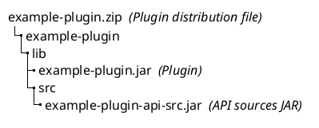

# Bundling Plugin API Sources

<!-- Copyright 2000-2024 JetBrains s.r.o. and contributors. Use of this source code is governed by the Apache 2.0 license. -->

<link-summary>Exposing plugin's API sources for other plugins.</link-summary>

如果一个插件暴露其自己的 API 供其他插件使用，考虑将插件的 API 源码捆绑在 ZIP 发布中是值得的。

如果第三方插件使用 [](tools_gradle_intellij_plugin.md) 并向捆绑源码的插件添加依赖，源码将自动附加到插件库中，并在开发者导航到 API 类时在 IDE 中可见。
能够查看 API 源码极大地提升了开发体验，强烈建议将其捆绑在一起。

> 从 Gradle IntelliJ Plugin 1.7.0 开始，可以在 IDE 中附加捆绑的插件源码。
>
{style="note"}

## API 源码位置

API 源码 JAR 文件必须位于插件 ZIP 发布中的 <path>example-plugin.zip!/plugin/lib/src</path> 目录，例如：



The plugin distribution ZIP file can contain multiple source JARs, and there are no strict rules for the source JAR names.

## 定义插件 API {id=定义插件API}

通常，以下类被视为插件 API：

- [扩展点](plugin_extension_points.md) 及相关类
- [监听器](plugin_listeners.md) 及相关类
- [服务](plugin_services.md) 和提供对插件数据/行为访问的实用程序

请记住，API 应该是稳定的，并且很少发生更改，因为每次不兼容的更改都会破坏客户端插件。
还建议将插件代码组织成具有清晰责任的多个模块，例如：

- `example-plugin-api` - 包含 API 的模块
- `example-plugin-impl` - 包含插件特性代码的模块，这些代码不适用于客户端插件

定义 API 的一般规则是包括可能被客户端插件代码消耗的类。

当然，更复杂的插件可能需要更细粒度的结构。
请参见 [Gradle IntelliJ 插件 - 使用示例](tools_gradle_intellij_plugin_examples.md)。

## 在 Gradle 构建脚本中捆绑 API 源码

在最简单的情况下，如果项目只包含一个模块且插件 API 明确定义在一个包中，例如 `com.example.plugin.openapi`，则可以通过在 Gradle 构建脚本的 `tasks` 部分添加以下代码片段来包含源码 JAR 文件：

<tabs>
<tab title="Kotlin">

```kotlin
tasks {
  val createOpenApiSourceJar by registering(Jar::class) {
    // Java 源代码
    from(sourceSets.main.get().java) {
      include("**/com/example/plugin/openapi/**/*.java")
    }
    // Kotlin 来源
    from(kotlin.sourceSets.main.get().kotlin) {
      include("**/com/example/plugin/openapi/**/*.kt")
    }
    destinationDirectory.set(layout.buildDirectory.dir("libs"))
    archiveClassifier.set("src")
  }

  buildPlugin {
    dependsOn(createOpenApiSourceJar)
    from(createOpenApiSourceJar) { into("lib/src") }
  }
}
```

</tab>
<tab title="Groovy">

```groovy
task createOpenApiSourceJar(type: Jar) {
  // Java 源代码
  from(sourceSets.main.java) {
    include '**/com/example/plugin/openapi/**/*.java'
  }
  // Kotlin 源代码
  from(sourceSets.main.kotlin) {
    include '**/com/example/plugin/openapi/**/*.kt'
  }
  destinationDirectory = layout.buildDirectory.dir('libs')
  archiveClassifier = 'src'
}

buildPlugin {
  dependsOn(createOpenApiSourceJar)
  from(createOpenApiSourceJar) { into 'lib/src' }
}
```

</tab>
</tabs>


上述配置将创建一个包含 `com.example.plugin.openapi` 包中的 Java 和 Kotlin 源文件的源码 JAR 文件，并将其添加到最终的插件 ZIP 发布中，位置为所需的 <path>example-plugin.zip!/example-plugin/lib/src</path> 目录。

如果您的插件是一个 Gradle 项目，并且没有明确的开放 API 包分离，建议将插件项目重构为 Gradle 多项目变体，并创建一个专门的开放 API 子项目，其中包含所有要包含在主插件 Gradle 项目创建的最终分发中的 API 源码。