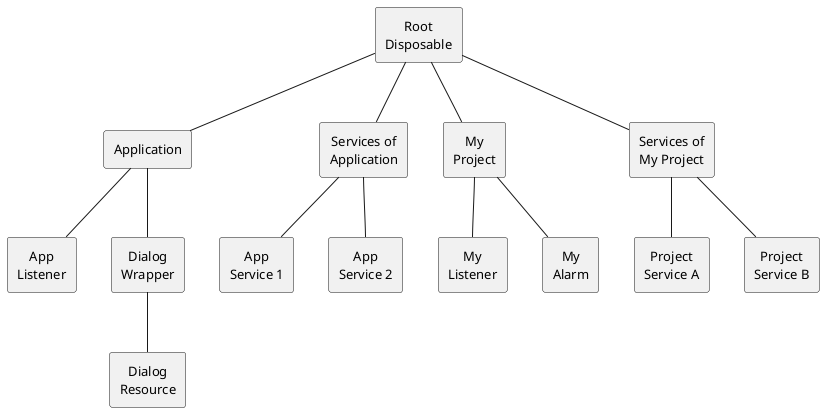

<!-- Copyright 2000-2024 JetBrains s.r.o. and contributors. Use of this source code is governed by the Apache 2.0 license. -->

# Disposer 和 Disposable

<link-summary>在插件组件生命周期结束时清理资源。</link-summary>

IntelliJ 平台的 [`Disposer`](%gh-ic%/platform/util/src/com/intellij/openapi/util/Disposer.java) 有助于资源清理。
如果一个子系统保持一组资源与父对象的生命周期一致，则该子系统的资源应注册到 `Disposer`，以便在父对象释放之前或同时释放。

`Disposer` 管理的最常见资源类型是监听器，但也可能有其他类型：
* 文件句柄和数据库连接，
* 缓存和其他重要的数据结构。

`Disposer` 是一个单例，管理 [`Disposable`](%gh-ic%/platform/util/src/com/intellij/openapi/Disposable.java) 实例的树。
`Disposable` 是一个接口，任何对象都可以实现它，提供一个 `Disposable.dispose()` 方法，在特定生命周期结束后释放重量级资源。

`Disposer` 支持将 `Disposable` 对象以父子关系链接起来。

## 自动释放的对象 {id=automatically-disposed-objects}

许多对象如果实现了 `Disposable` 接口，平台会自动释放它们。
其中最重要的类型是 [服务](plugin_services.md)。
应用程序级服务在 IDE 关闭或提供服务的插件卸载时由平台自动释放。
项目级服务在项目关闭或插件卸载事件时释放。

请注意，在 <path>[plugin.xml](plugin_configuration_file.md)</path> 中注册的扩展*不会*自动释放。
如果扩展需要执行一些代码来释放它，你需要定义一个服务，并将代码放在其 `dispose()` 方法中，或将其用作父级 disposable。

## `Disposer` 单例 {id=the-disposer-singleton}
[`Disposer`](%gh-ic%/platform/util/src/com/intellij/openapi/util/Disposer.java) 单例的主要目的是强制执行 _子 `Disposable` 永远不会比其父级存活更久_ 的规则。

`Disposer` 将 `Disposable` 对象组织成父子关系的树。
`Disposable` 对象的树确保 `Disposer` 先释放父级的子级。
父对象总是比它们的子对象存活更久。

下图展示了 `Disposer` 树的简化示例：



当 _My Project_ 关闭并由平台触发其释放时，Disposer API 将在释放 _My Project_ 之前释放 _My Listener_ 和 _My Alarm_，并在释放 _Services of My Project_ 之前释放 _Project Service A_ 和 _Project Service B_。

有关创建 `Disposable` 类的更多信息，请参阅 [The Disposable Interface](#implementing-the-disposable-interface)。

注册 disposable 是通过调用 `Disposer.register()` 来完成的：

```java
Disposer.register(parentDisposable, childDisposable);
```

### 选择 Disposable 父级 {id=choosing-a-disposable-parent}

为了注册一个子 `Disposable`，需要使用一个具有合适生命周期的父 `Disposable` 来建立父子关系。
可以选择 IntelliJ 平台提供的父 `Disposable` 之一，也可以是另一个 `Disposable`。

使用以下指南选择正确的父级：

* 对于插件整个生命周期所需的资源，使用应用程序或项目级别的 [服务](plugin_services.md)。例如：[`PythonPluginDisposable`](%gh-ic%/python/openapi/src/com/jetbrains/python/PythonPluginDisposable.java)。
* 对于 [对话框](dialog_wrapper.md) 显示期间所需的资源，使用 `DialogWrapper.getDisposable()`。
* 对于 [工具窗口](tool_windows.md) 选项卡显示期间所需的资源，将实现 `Disposable` 的实例传递给 `Content.setDisposer()`。
* 对于生命周期较短的资源，使用 `Disposer.newDisposable()` 创建一个 disposable，并使用 `Disposable.dispose()` 手动释放它。
  请注意，最好始终为此类 disposable 指定一个父级（例如项目级别的服务），以便在由于异常或编程错误未调用 `Disposable.dispose()` 时不会发生内存泄漏。

> 尽管 `Application` 和 `Project` 实现了 `Disposable`，但它们**绝不能**在插件代码中用作父级 disposable。
> 使用这些对象作为父级注册的 disposable 在插件卸载时不会被释放，从而导致内存泄漏。
>
> 考虑一个由插件创建并使用项目作为其父级注册的 disposable 资源的情况。
> 以下生命周期图显示该资源将比插件存活更久，并与项目共存。
> ```mermaid
> %%{init: {'theme': 'base', 'themeVariables': { 'primaryBorderColor': 'green', 'background': 'yellow'}}}%%
> gantt
>     dateFormat X
>     %% do not remove trailing space in axisFormat
>     axisFormat ‎
>     section Lifetimes
>         Project         : 0, 10
>         Plugin          : 2, 5
>         Plugin Resource : crit, 3, 10
> ```
>
> 如果资源使用了例如插件的项目级服务（如果可以使用生命周期更短的父级，则优先使用它们），资源将与插件一起被释放：
> ```mermaid
> gantt
>     dateFormat X
>     %% do not remove trailing space in axisFormat
>     axisFormat ‎
>     section Lifetimes
>         Project         : 0, 10
>         Plugin          : 2, 5
>         Plugin Resource : 3, 5
> ```
>
> 检查 <control>插件开发工具包 | 代码 | 不正确的 parentDisposable 参数</control> 将突出显示此类问题。
>
{style="warning" title="插件 disposable 泄漏"}

`Disposer` API 的灵活性意味着，如果父级实例选择不当，子级可能会消耗比所需时间更长的资源。
当不再需要资源时继续使用它们可能会成为一个严重的资源竞争问题，因为每次调用都会留下一些僵尸对象。
另一个挑战是，这些问题不会被常规的泄漏检查工具报告，因为从测试套件的角度来看，技术上这不是内存泄漏。

例如，假设为特定操作创建的 UI 组件使用项目级服务作为父级 disposable。
在这种情况下，操作完成后整个组件将保留在内存中。
这会增加内存压力，并可能浪费 CPU 周期来处理不再相关的事件。

### 使用父级 Disposable 注册监听器 {id=registering-listeners-with-parent-disposable}

许多 IntelliJ 平台 API 用于注册监听器时，要么需要传递父级 disposable，要么有重载方法可以接受父级 disposable。
例如：

```java
public abstract class EditorFactory {
  // ...
  public abstract void addEditorFactoryListener(@NotNull EditorFactoryListener listener);
  public abstract void addEditorFactoryListener(@NotNull EditorFactoryListener listener, @NotNull Disposable parentDisposable);
  public abstract void removeEditorFactoryListener(@NotNull EditorFactoryListener listener);
}
```

带有 `parentDisposable` 参数的方法在相应的父级 disposable 被释放时自动取消订阅监听器。
使用此类方法总是比从 `dispose` 方法中显式移除监听器更可取，因为它需要更少的代码并且更容易验证正确性。

要选择正确的父级 disposable，请使用上一节中的指南。

同样的规则适用于 [消息总线](messaging_infrastructure.md) 连接。
始终将父级 disposable 传递给 `MessageBus.connect()`，并确保其生命周期尽可能短。

### 确定释放状态 {id=determining-disposal-status}
你可以使用 `Disposer.isDisposed()` 来检查 `Disposable` 是否已被释放。
例如，对于异步回调到一个可能在回调执行之前被释放的 `Disposable`，这种检查非常有用。
在这种情况下，通常最好的策略是什么都不做并提前返回。

> 未释放的对象不应持有对已释放对象的引用，因为这会导致内存泄漏。
> 一旦 `Disposable` 被释放，它应该完全处于非活动状态，并且没有理由再引用它。
>
{style="warning"}

### 结束 Disposable 生命周期 {id=ending-a-disposable-lifecycle}
插件可以通过调用 `Disposer.dispose(Disposable)` 手动结束 `Disposable` 的生命周期。
此方法还会递归释放所有 `Disposable` 子级。

## 实现 `Disposable` 接口 {id=implementing-the-disposable-interface}

创建一个类需要实现 `Disposable` 接口并定义 `dispose()` 方法。

在许多情况下，当对象实现 `Disposable` 仅用作父级 disposable 时，该方法的实现将完全为空。

以下是一个非平凡的 `dispose` 实现示例：

```java
public class Foo<T> extends JBFoo implements Disposable {

  public Foo(@NotNull Project project,
             @NotNull String name,
             @Nullable FileEditor fileEditor,
             @NotNull Disposable parentDisposable) {
    this(project, name, fileEditor, InitParams.createParams(project),
        DetachedToolWindowManager.getInstance(project));
    Disposer.register(parentDisposable, this);
  }

  @Override
  public void dispose() {
    myFooManager.unregister(this);
    myDetachedToolWindowManager.unregister(myFileEditor);
    KeyboardFocusManager.getCurrentKeyboardFocusManager()
        .removePropertyChangeListener("focusOwner", myMyPropertyChangeListener);
    setToolContext(null);
  }
}
```

为了简化，省略了大量设置需要在 `dispose()` 中释放所有条件的代码。

尽管如此，它展示了基本模式，即：
* 在这种情况下，父级 disposable 被传递到构造函数中，
* `Foo` disposable 在构造函数中注册为 `parentDisposable` 的子级。
* `dispose()` 方法整合了必要的释放操作，并将由 `Disposer` 调用。

> 永远不要直接调用 `Disposable.dispose()`，因为它绕过了在 `Disposer` 中建立的父子关系。
> 始终调用 `Disposer.dispose(Disposable)` 代替。
>
{style="warning"}

## 诊断 `Disposer` 泄漏 {id=diagnosing-disposer-leaks}

当应用程序退出时，它会执行最终的健康检查以验证所有内容是否已释放。
如果某些内容已注册到 `Disposer` 但未被释放，IntelliJ 平台会在关闭前报告它。

在测试、[内部](enabling_internal.md) 和调试模式下（在 <ui-path>帮助 | 编辑自定义属性...</ui-path> 中添加 `idea.disposer.debug=on`），将 `Disposable` 注册到 `Disposer` 时还会注册对象分配路径的堆栈跟踪。
`Disposer` 通过在注册时创建一个 `Throwable` 来实现这一点。

以下片段代表了在实践中遇到的“检测到内存泄漏”错误：

```text
    java.lang.RuntimeException:
    Memory leak detected: <Instance> of class <com.example.classtype>
    See the cause for the corresponding Disposer.register() stacktrace:
        at ObjectTree.assertIsEmpty(ObjectTree.java:209)
        at Disposer.assertIsEmpty(Disposer.java:125)
        at Disposer.assertIsEmpty(Disposer.java:121)
        at ApplicationImpl.disposeSelf(ApplicationImpl.java:323)
        at ApplicationImpl.doExit(ApplicationImpl.java:780)
        …
    Caused by: java.lang.Throwable
        at ObjectTree.getOrCreateNodeFor(ObjectTree.java:101)
        at ObjectTree.register(ObjectTree.java:62)
        at Disposer.register(Disposer.java:81)
        at Disposer.register(Disposer.java:75)
        …
        at ProjectManagerEx.createProject(ProjectManagerEx.java:69)
        at NewProjectWizardDynamic.doFinish(NewProjectWizardDynamic.java:235)
        at DynamicWizard$1.run(DynamicWizard.java:433)
        at CoreProgressManager$5.run(CoreProgressManager.java:237)
        at CoreProgressManager$TaskRunnable.run(CoreProgressManager.java:563)
        …
```

> 调用堆栈的第一部分与诊断内存泄漏无关。
> 相反，请注意调用堆栈的第二部分，即 `Caused by: java.lang.Throwable` 之后的部分。
>

在这个特定情况下，IntelliJ 平台（[`CoreProgressManager`](%gh-ic%/platform/core-impl/src/com/intellij/openapi/progress/impl/CoreProgressManager.java)）启动了一个包含 `DynamicWizard` 代码的任务。
反过来，该代码分配了一个 `Project`，该 `Project` 在应用程序退出时从未被释放。
这是一个值得开始挖掘的地方。

上述内存泄漏最终是由于未能将 `Project` 实例传递给负责注册它以进行释放的函数引起的。
通常，修复内存泄漏的方法很简单，只需了解所分配对象的内存范围（通常是 UI 容器、项目或应用程序），并确保为其适当地调用 `Disposer.register()`。