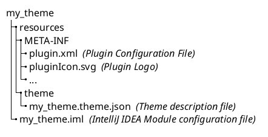

<!-- Copyright 2000-2024 JetBrains s.r.o. and contributors. Use of this source code is governed by the Apache 2.0 license. -->

# 创建主题项目

<link-summary>Creating a theme plugin project with Plugin DevKit wizard and generated project overview.</link-summary>

本文档页面描述了使用[新建项目向导](https://www.jetbrains.com/help/idea/new-project-wizard.html)生成的基于 DevKit 的主题项目。

## 使用新建项目向导创建主题

> 在创建主题项目之前，请确保[已设置好开发环境](setting_up_theme_environment.md)。

<procedure title="创建主题插件" id="create-theme">

通过 <control>新项目</control> 向导 <ui-path>File | New | Project...</ui-path> 操作并提供以下信息:
1. 从左侧列表中选择 <control>IDE 插件</control> 生成器类型。
2. 指定项目 <control>名称</control> 和 <control>位置</control> 。
3. 在项目 <control>类型</control> 中选择 <control>主题</control> 选项。
4. 作为 <control>JDK</control>，选择[配置的SDK](setting_up_theme_environment.md#intellij-sdk)。
5. 点击 <control>创建</control> 按钮来生成项目。

</procedure>

### 根据向导生成的 Gradle IntelliJ 平台主题的组件

使用上述步骤创建的示例 “my_theme”，_IDE 插件_ 将生成以下目录内容：

<path>META-INF</path> directory with:
  - <path>[plugin.xml](plugin_configuration_file.md)</path> configuration file containing preconfigured theme provider
  - <path>pluginIcon.svg</path> file that is a [plugin logo](plugin_icon_file.md)

    Replace it with a custom logo representing the Theme.
- <path>my_theme.theme.json</path> - a minimal [theme description file](themes_customize.md#introduction-to-theme-description-file-syntax)
- <path>my_theme.iml</path> - [IntelliJ IDEA Module](https://www.jetbrains.com/help/idea/creating-and-managing-modules.html) configuration file

See  for more details.

## 额外的插件主题

主题插件项目[使用新建项目向导创建](#create-theme)默认包含一个主题描述文件。
如果插件需要提供多个主题（例如，深色和浅色变体），可以使用专用操作添加它们。

可以使用 _Plugin DevKit_ 插件中的 DevKit 主题向导来添加额外的插件主题。
该向导可用于基于 DevKit 和基于 Gradle 的插件。

<procedure title="添加主题" id="add-theme">

1. 在<control>Project</control>工具窗口中，选择<path>resources</path>目录，并右键单击以调出上下文菜单。
2. 选择<ui-path>New | Plugin DevKit | Theme</ui-path>操作。

   It is a good practice to include the name of the plugin in the created theme name.
3. Check the <control>Dark theme</control> checkbox if the created theme should be based on IntelliJ IDEA _Darcula_ theme.
   Otherwise, the _Light_ theme will be used as the base.
4. Click <control>OK</control> button to generate the [theme description file](themes_customize.md#introduction-to-theme-description-file-syntax) with <path>\$THEME_NAME\$.theme.json</path> name. The generated theme will be automatically configured in the <path>plugin.xml</path> file.

</procedure>

## Bundling Color Schemes

Use `com.intellij.bundledColorScheme` extension point specifying the `path` to the color scheme XML file (without `.xml` suffix).
Specify attribute `id` for this extension in <path>plugin.xml</path> matching its `name` attribute value from the color scheme XML.
