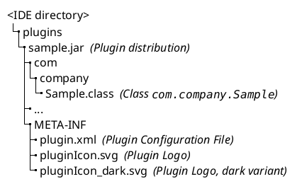
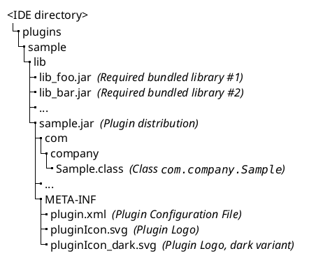

<!-- Copyright 2000-2024 JetBrains s.r.o. and contributors. Use of this source code is governed by the Apache 2.0 license. -->

# Plugin Content

<link-summary>Layout and contents of a plugin distribution file.</link-summary>

插件分发将使用[Gradle](tools_gradle_intellij_plugin.md#tasks-buildplugin)或[Plugin DevKit](deploying_theme.md)进行构建。

The plugin distribution <path>.jar</path> file contains:

- configuration file (<path>META-INF/plugin.xml</path>) ([Plugin Configuration File](plugin_configuration_file.md))
- classes implementing the plugin functionality
- recommended: plugin logo file(s) (<path>META-INF/pluginIcon*.svg</path>) ([Plugin Logo](plugin_icon_file.md))

> See  for important steps to optimize the plugin distribution file.

无法将插件分发目标指定为特定的操作系统（[问题](https://youtrack.jetbrains.com/issue/MP-1896)）。

### 无依赖插件

由一个单一的 `<path>.jar</path>` 文件组成的插件被放置在 `<path>/plugins</path>` 目录中。

### 有依赖插件 {id=有依赖插件}

插件 `<path>.jar</path>` 文件与所有必需的捆绑库一起放置在插件的 "root" 文件夹下的 `<path>/lib</path>` 文件夹中。

来自 `<path>/lib</path>` 文件夹的所有 jar 文件都会自动添加到类路径中（请参阅 [插件类加载器](plugin_class_loaders.md)）。

> 不要将库重新打包到主插件存档中（在下面示例中的 `<path>sample.jar</path>`）。
> 否则，[插件验证器](verifying_plugin_compatibility.md) 将对未解析的类和方法产生错误的检测结果。
>
{title="Do Not Repackage Libraries" style="warning"}

