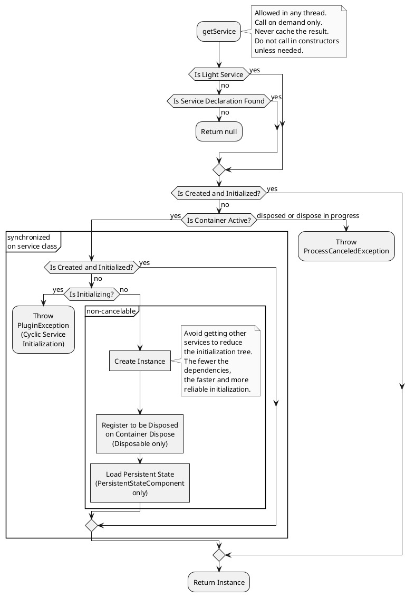

<!-- Copyright 2000-2024 JetBrains s.r.o. and contributors. Use of this source code is governed by the Apache 2.0 license. -->

# 服务

<link-summary>注册和使用按需服务，以封装插件功能。</link-summary>

A _service_ is a plugin component loaded on demand when your plugin calls the `getService()` method of corresponding [`ComponentManager`](%gh-ic%/platform/extensions/src/com/intellij/openapi/components/ComponentManager.java) instance (see [Types](#types)).
The IntelliJ Platform ensures that only one instance of a service is loaded even though it is called several times.
Services are used to encapsulate logic operating on a set of related classes or to provide some reusable functionality that can be used across the plugin project.
Conceptually, they don't differ from the service classes in other languages or frameworks.

A service must have an implementation class used for service instantiation.
A service may also have an interface class used to obtain the service instance and provide the service's API.

A service needing a shutdown hook/cleanup routine can implement [`Disposable`](%gh-ic%/platform/util/src/com/intellij/openapi/Disposable.java) and perform necessary work in `dispose()` (see [](disposers.md#automatically-disposed-objects)).

> If declared services are intended to be used by other plugins depending on your plugin, consider [bundling their sources](bundling_plugin_openapi_sources.md) in the plugin distribution.
>
{style="note" title="Services as API"}

#### 类型 {id=类型}

IntelliJ 平台提供三种类型的服务：_应用级_ 服务（全局单例）、_项目级_ 服务和 _模块级_ 服务。
对于后两者，将为其相应范围的每个实例创建一个单独的服务实例，参见 [项目模型介绍](project_structure.md)。

> 避免使用模块级服务，因为它可能会增加具有许多模块的项目的内存使用。
>
{style="note"}
{id="moduleServiceNote"}

#### 构造函数 {id=构造函数}

To improve startup performance, avoid any heavy initializations in the constructor.

Project/Module-level service constructors can have a [`Project`](%gh-ic%/platform/core-api/src/com/intellij/openapi/project/Project.java)/[`Module`](%gh-ic%/platform/core-api/src/com/intellij/openapi/module/Module.java) argument.

> 出于性能原因，已弃用（并且在 [](#轻量级服务) 中不支持）使用构造函数注入依赖服务。
>
> 所有其他服务依赖项必须在所有相应方法中 [仅在需要时获取](#获取服务)，例如，如果需要服务来获取一些数据或执行任务，请在调用其方法之前检索服务。
> 不要在构造函数中检索服务以将它们存储在类字段中。
>
> 使用检查 <control>Plugin DevKit | Code | Non-default constructors for service and extension class</control> 来验证代码。
>
{style="warning" title="Do not use Constructor Injection"}

##### Kotlin Coroutines

When using [](kotlin_coroutines.md), a distinct service [scope](coroutine_scopes.md) can be injected as parameter.

<include from="coroutine_scopes.md" element-id="serviceScopes"/>

## 轻量级服务 {id=轻量级服务}

A service not going to be overridden/exposed as API to other plugins does not need to be registered in <path>[plugin.xml](plugin_configuration_file.md)</path> (see [](#declaring-a-service)).
Instead, annotate service class with [`@Service`](%gh-ic%/platform/core-api/src/com/intellij/openapi/components/Service.java) (see [](#examples)).
The service instance will be created in scope according to the caller (see [](#retrieving-a-service)).

### 轻量级服务限制

* 没有必需的属性：`os`、`client`、`overrides`、`id`、`preload`。
* 服务类必须是 `final`。
* 不支持[依赖服务的构造函数注入](#构造函数)。
* 如果应用级服务是 [PersistentStateComponent](persisting_state_of_components.md)，必须禁用漫游（`roamingType = RoamingType.DISABLED`）。

使用以下检查来验证这些限制并突出显示可以转换的服务（2023.3）：
- <control>Plugin DevKit | Code | Light service must be final</control>
- <control>Plugin DevKit | Code | Mismatch between light service level and its constructor</control>
- <control>Plugin DevKit | Code | A service can be converted to a light one</control> 和相应的 <control>Plugin DevKit | Plugin descriptor | A service can be converted to a light one</control> 用于 <path>plugin.xml</path>

### 示例

<tabs group="languages">


<tab title="Java" group-key="java">

应用级轻量级服务：

```java
@Service
public final class MyAppService {
  public void doSomething(String param) {
    // ...
  }
}
```

项目级轻量级服务示例：

```java
@Service(Service.Level.PROJECT)
public final class MyProjectService {
  private final Project myProject;

  MyProjectService(Project project) {
    myProject = project;
  }

  public void doSomething(String param) {
    String projectName = myProject.getName();
    // ...
  }
}
```

</tab>

<tab title="Kotlin" group-key="kotlin">

应用级轻量级服务：

```kotlin
@Service
class MyAppService {
  fun doSomething(param: String) {
    // ...
  }
}
```

项目级轻量级服务示例：

```kotlin
@Service(Service.Level.PROJECT)
class MyProjectService(private val project: Project) {
  fun doSomething(param: String) {
    val projectName = project.name
    // ...
  }
}
```

</tab>

</tabs>

## 声明服务

要注册非 [轻量级服务](#轻量级服务)，为每种类型提供了不同的扩展点：

* `com.intellij.applicationService` - application-level service
* `com.intellij.projectService` - project-level service
* `com.intellij.moduleService` - module-level service (not recommended, see [Note](#types))

To expose service API, create a separate class for `serviceInterface` and extend it in corresponding class registered in `serviceImplementation`.
If `serviceInterface` isn't specified, it's supposed to have the same value as `serviceImplementation`.
Use inspection <control>Plugin DevKit | Plugin descriptor | Plugin.xml extension registration</control> to highlight redundant `serviceInterface` declarations.

To provide a custom implementation for test/headless environment, specify `testServiceImplementation`/`headlessImplementation` additionally.

### 示例


<tabs group="languages">

<tab title="Java" group-key="java">

应用级服务：

- 接口：

  ```java
  public interface MyAppService {
    void doSomething(String param);
  }
  ```

- 实现：

  ```java
  final class MyAppServiceImpl implements MyAppService {
    @Override
    public void doSomething(String param) {
      // ...
    }
  }
  ```

项目级服务：

- 接口：

  ```java
  public interface MyProjectService {
    void doSomething(String param);
  }
  ```

- 实现：

  ```java
  final class MyProjectServiceImpl implements MyProjectService {
    private final Project myProject;

    MyProjectServiceImpl(Project project) {
      myProject = project;
    }

    public void doSomething(String param) {
      String projectName = myProject.getName();
      // ...
    }
  }
  ```
</tab>

<tab title="Kotlin" group-key="kotlin">

应用级服务：

- 接口：

  ```kotlin
  interface MyAppService {
    fun doSomething(param: String)
  }
  ```

- 实现：

  ```kotlin
  internal class MyAppServiceImpl : MyAppService {
    override fun doSomething(param: String) {
      // ...
    }
  }
  ```

项目级服务：

- 接口：

  ```kotlin
  interface MyProjectService {
    fun doSomething(param: String)
  }
  ```

- 实现：

  ```kotlin
  internal class MyProjectServiceImpl(private val project: Project)
      : MyProjectService {

    fun doSomething(param: String) {
      val projectName = project.name
      // ...
    }
  }
  ```
</tab>

</tabs>

在 <path>plugin.xml</path> 中注册：
```xml
<extensions defaultExtensionNs="com.intellij">
  <!-- 声明应用级服务 -->
  <applicationService
      serviceInterface="com.example.MyAppService"
      serviceImplementation="com.example.MyAppServiceImpl"/>

  <!-- 声明项目级服务 -->
  <projectService
      serviceInterface="com.example.MyProjectService"
      serviceImplementation="com.example.MyProjectServiceImpl"/>
</extensions>
```

## Retrieving a Service

> **Never** acquire service instances prematurely or store them in fields for later use.
> Instead, **always** obtain service instances directly and **only** at the location where they're needed.
> Failing to do so will lead to unexpected exceptions and severe consequences for the plugin's functionality.
>
> 此类问题通过检查（2023.3）突出显示：
> - <control>Plugin DevKit | Code | Application service assigned to a static final field or immutable property</control>
> - <control>Plugin DevKit | Code | Incorrect service retrieving</control>
> - <control>Plugin DevKit | Code | Simplifiable service retrieving</control>
>
{style="warning" title="Correct Service Retrieval"}

获取服务不需要读取动作，可以在任何线程中执行。
如果从多个线程请求服务，则它将在第一个线程中初始化，并阻塞其他线程，直到它完全初始化。

<tabs group="languages">
<tab title="Java" group-key="java">

```java
MyAppService applicationService =
    ApplicationManager.getApplication().getService(MyAppService.class);

MyProjectService projectService =
    project.getService(MyProjectService.class);
```

服务实现可以使用方便的静态 `getInstance()` 或 `getInstance(Project)` 方法包装这些调用：

```java
MyAppService applicationService = MyAppService.getInstance();

MyProjectService projectService = MyProjectService.getInstance(project);
```

</tab>

<tab title="Kotlin" group-key="kotlin">

```kotlin
val applicationService = service<MyAppService>()

val projectService = project.service<MyProjectService>()
```
</tab>

</tabs>

<chapter title="Getting Service Flow" collapsible="true" default-state="collapsed">



</chapter>

## 示例插件

To clarify how to use services, consider the **maxOpenProjects** sample plugin available in the [code samples](%gh-sdk-samples-master%/max_opened_projects).

该插件有一个应用级服务，用于计算当前在IDE中打开的项目数。
如果此数字超过插件允许的同时打开的项目的最大数量（3），则显示信息消息。

请参阅 [代码示例](code_samples.md) 了解如何设置和运行该插件。
