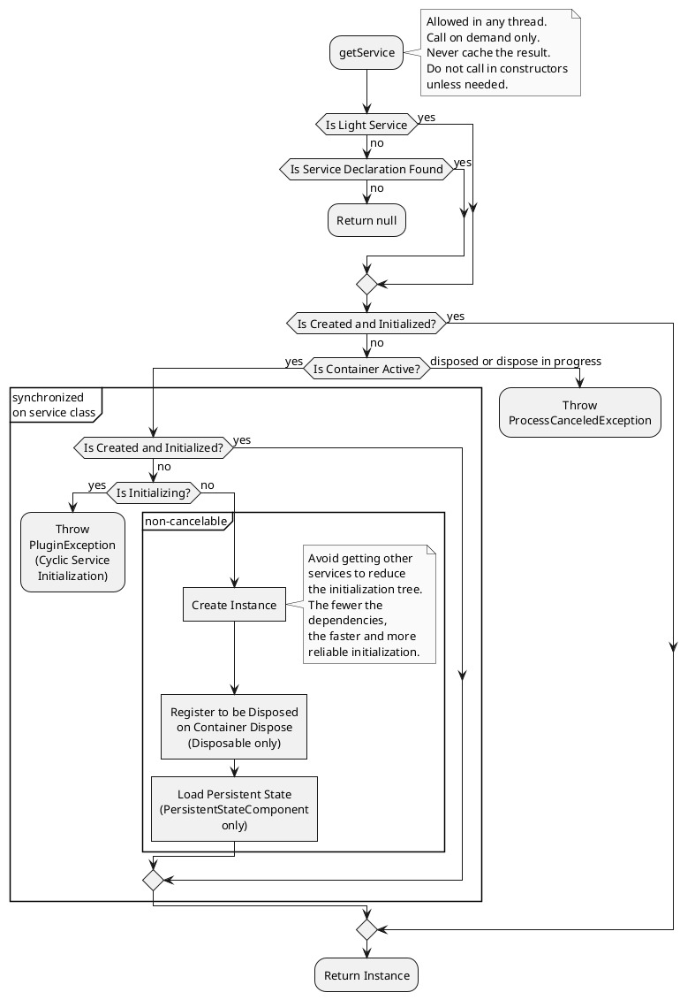

<!-- Copyright 2000-2024 JetBrains s.r.o. and contributors. Use of this source code is governed by the Apache 2.0 license. -->

# 服务

<link-summary>注册和使用按需服务，以封装插件功能。</link-summary>

一个 **service** 是插件的一个组件，在你的插件调用相应 [`ComponentManager`](%gh-ic%/platform/extensions/src/com/intellij/openapi/components/ComponentManager.java) 实例的 `getService()` 方法时按需加载（参见 [Types](#types)）。
IntelliJ 平台确保即使多次调用，也只加载一个服务实例。
Services 用于封装操作一组相关类或提供可在插件项目中重复使用的功能逻辑。
从概念上讲，它们与其他语言或框架中的服务类别无异。

一个 service 必须有一个用于实例化服务的实现类。
一个 service 还可以有一个接口类，用于获取服务实例并提供服务的 API。

如果一个 service 需要关机钩子或清理例程，可以实现 [`Disposable`](%gh-ic%/platform/util/src/com/intellij/openapi/Disposable.java)，并在 `dispose()` 方法中执行必要的工作（参见 [](disposers.md#automatically-disposed-objects)）。

> 如果声明的服务打算被依赖你的插件的其他插件使用，请考虑在插件分发中 [捆绑它们的源代码](bundling_plugin_openapi_sources.md)。
>
{style="note" title="作为 API 的 Services"}

#### 类型 {id=types}

IntelliJ 平台提供三种类型的服务：_应用级_ 服务（全局单例）、_项目级_ 服务和 _模块级_ 服务。
对于后两者，将为其相应范围的每个实例创建一个单独的服务实例，参见 [项目模型介绍](project_model.md)。

> 避免使用模块级服务，因为它可能会增加具有许多模块的项目的内存使用。
>
{style="note"}
{id="moduleServiceNote"}

#### 构造函数
{#ctor}

为了提高启动性能，请避免在构造函数中进行任何繁重的初始化。

项目/模块级服务构造函数可以有一个 [`Project`](%gh-ic%/platform/core-api/src/com/intellij/openapi/project/Project.java)/[`Module`](%gh-ic%/platform/core-api/src/com/intellij/openapi/module/Module.java) 参数。

> 出于性能原因，不推荐使用依赖服务的构造函数注入（并且在 [](#light-services) 中不支持）。
>
> 其他服务依赖项必须在所有相应的方法中[仅在需要时获取](#retrieving-a-service)，例如，如果您需要一个服务来获取一些数据或执行一个任务，请在调用其方法之前检索该服务。
> 不要在构造函数中检索服务以将其存储在类字段中。
>
> 使用检查 <control>Plugin DevKit | Code | Non-default constructors for service and extension class</control> 来验证代码。
>
{style="warning" title="不要使用构造函数注入"}

##### Kotlin 协程 {id=kotlin-coroutines}

使用 [](kotlin_coroutines.md) 时，可以将不同的服务 [范围](coroutine_scopes.md) 注入为参数。

<include from="coroutine_scopes.md" element-id="serviceScopes"/>

## 轻量级服务 {id=light-services}

一个不打算被覆盖或暴露为其他插件 API 的服务，不需要在 <path>[plugin.xml](plugin_configuration_file.md)</path> 中注册（参见 [](#declaring-a-service)）。  
相反，使用 [`@Service`](%gh-ic%/platform/core-api/src/com/intellij/openapi/components/Service.java) 注解服务类（参见 [](#examples)）。  
该服务实例将在调用者的作用域内创建（参见 [](#retrieving-a-service)）。

### 轻量级服务限制

* 以下属性/限制（适用于 [非轻量级服务的注册](#declaring-a-service)）不允许使用：`id`、`os`、`client`、`overrides`、`configurationSchemaKey`/`preload`（内部 API）。
* 不需要单独的无头/测试实现。
* 服务类必须是 `final`。
* 不支持 [构造函数注入](#ctor) 依赖服务。
* 如果一个应用级服务是 [PersistentStateComponent](persisting_state_of_components.md)，则必须禁用漫游（`roamingType = RoamingType.DISABLED`）。

使用以下检查来验证上述限制，并突出显示可以转换为轻量级服务的非轻量级服务（2023.3）：

- <control>Plugin DevKit | Code | 轻量服务必须是 final 的</control>
- <control>Plugin DevKit | Code | 轻量服务级别与其构造函数不匹配</control>
- <control>Plugin DevKit | Code | 服务可以转换为轻量服务</control> 和相应的 <control>Plugin DevKit | Plugin descriptor | 服务可以转换为轻量服务</control> 用于 <path>plugin.xml</path>

### Examples {id=examples}

{id="lightServiceExamples"}

<tabs group="languages">


<tab title="Java" group-key="java">

应用级轻量级服务：

```java

@Service
public final class MyAppService {

  public void doSomething(String param) {
    // ...
  }

}
```

项目级轻量级服务示例：

```java

@Service(Service.Level.PROJECT)
public final class MyProjectService {

  private final Project myProject;

  MyProjectService(Project project) {
    myProject = project;
  }

  public void doSomething(String param) {
    String projectName = myProject.getName();
    // ...
  }

}
```

</tab>

<tab title="Kotlin" group-key="kotlin">

应用级轻量级服务：

```kotlin
@Service
class MyAppService {
  fun doSomething(param: String) {
    // ...
  }
}
```

项目级轻量级服务示例：

```kotlin
@Service(Service.Level.PROJECT)
class MyProjectService(private val project: Project) {
  fun doSomething(param: String) {
    val projectName = project.name
    // ...
  }
}
```

</tab>

</tabs>

## 声明服务 {id=declaring-a-service}

要注册非 [轻量级服务](#light-services)，为每种类型提供了不同的扩展点：

* `com.intellij.applicationService` – 应用级服务
* `com.intellij.projectService` – 项目级服务
* `com.intellij.moduleService` – 模块级服务（不推荐，参见 [备注](#types)）

服务实现通过必需的 `serviceImplementation` 属性指定。

### 服务 API {id=service-api}

要暴露服务的 API，创建一个单独的类作为 `serviceInterface`，并在 `serviceImplementation` 中注册的相应类中进行扩展。  
如果没有指定 `serviceInterface`，则默认它的值与 `serviceImplementation` 相同。  
使用检查 <control>Plugin DevKit | Plugin descriptor | Plugin.xml extension registration</control> 来突出显示冗余的 `serviceInterface` 声明。

### 额外属性 {id=additional-attributes}

可以通过 `os` 属性将服务限制为特定的操作系统。

为了在测试或无头环境中提供自定义实现，分别指定 `testServiceImplementation` 或 `headlessImplementation`。

### 示例

<tabs group="languages">

<tab title="Java" group-key="java">

应用级服务：

- 接口：

  ```java
  public interface MyAppService {
    void doSomething(String param);
  }
  ```

- 实现：

  ```java
  final class MyAppServiceImpl implements MyAppService {
    @Override
    public void doSomething(String param) {
      // ...
    }
  }
  ```

项目级服务：

- 接口：

  ```java
  public interface MyProjectService {
    void doSomething(String param);
  }
  ```

- 实现：

  ```java
  final class MyProjectServiceImpl implements MyProjectService {
    private final Project myProject;

    MyProjectServiceImpl(Project project) {
      myProject = project;
    }

    public void doSomething(String param) {
      String projectName = myProject.getName();
      // ...
    }
  }
  ```

</tab>

<tab title="Kotlin" group-key="kotlin">

应用级服务：

- 接口：

  ```kotlin
  interface MyAppService {
    fun doSomething(param: String)
  }
  ```

- 实现：

  ```kotlin
  internal class MyAppServiceImpl : MyAppService {
    override fun doSomething(param: String) {
      // ...
    }
  }
  ```

项目级服务：

- 接口：

  ```kotlin
  interface MyProjectService {
    fun doSomething(param: String)
  }
  ```

- 实现：

  ```kotlin
  internal class MyProjectServiceImpl(private val project: Project)
      : MyProjectService {

    fun doSomething(param: String) {
      val projectName = project.name
      // ...
    }
  }
  ```

</tab>

</tabs>

在 <path>plugin.xml</path> 中注册：
```xml

<extensions defaultExtensionNs="com.intellij">
  <!-- 声明应用级服务 -->
  <applicationService
          serviceInterface="com.example.MyAppService"
          serviceImplementation="com.example.MyAppServiceImpl"/>

  <!-- 声明项目级服务 -->
  <projectService
          serviceInterface="com.example.MyProjectService"
          serviceImplementation="com.example.MyProjectServiceImpl"/>
</extensions>
```

## 获取服务 {id=retrieving-a-service}

> **永远不要** 提前获取服务实例或将它们存储在字段中以供以后使用。
> 相反，**始终** 在需要的地方直接获取服务实例。
> 否则，会导致意外异常和插件功能的严重后果。
>
> 此类问题通过检查（2023.3）突出显示：
> - <control>Plugin DevKit | Code | Application service assigned to a static final field or immutable property</control>
> - <control>Plugin DevKit | Code | Incorrect service retrieving</control>
> - <control>Plugin DevKit | Code | Simplifiable service retrieving</control>
>
{style="warning" title="正确的服务获取"}

获取服务不需要读操作，可以在任何线程中执行。  
如果一个服务被多个 [线程](threading_model.md) 请求，它将在第一个线程中初始化，其他线程将在服务完全初始化之前被阻塞。

<tabs group="languages">
<tab title="Java" group-key="java">

```java
MyAppService applicationService =
    ApplicationManager.getApplication().getService(MyAppService.class);

MyProjectService projectService =
    project.getService(MyProjectService.class);
```

服务实现可以使用方便的静态 `getInstance()` 或 `getInstance(Project)` 方法包装这些调用：

```java
MyAppService applicationService = MyAppService.getInstance();

MyProjectService projectService = MyProjectService.getInstance(project);
```

</tab>

<tab title="Kotlin" group-key="kotlin">

```kotlin
val applicationService = service<MyAppService>()

val projectService = project.service<MyProjectService>()
```

</tab>

</tabs>

<chapter title="获取服务流程" collapsible="true" default-state="collapsed">



</chapter>

## 示例插件

为了说明如何使用服务，请参考 [代码示例](%gh-sdk-samples-master%/max_opened_projects) 中提供的 **maxOpenProjects** 示例插件。

该插件有一个应用级服务，用于计算当前在IDE中打开的项目数。
如果此数字超过插件允许的同时打开的项目的最大数量（3），则显示信息消息。

请参阅 [代码示例](code_samples.md) 了解如何设置和运行该插件。
