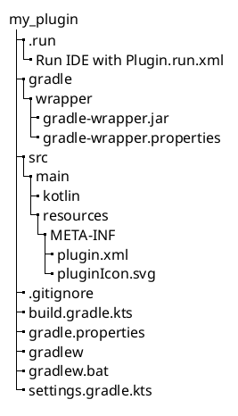

<!-- Copyright 2000-2024 JetBrains s.r.o. and contributors. Use of this source code is governed by the Apache 2.0 license. -->

# 创建一个插件 Gradle 项目

<link-summary>创建和运行基于 Gradle 的 IntelliJ 平台插件项目。</link-summary>

本文档页面描述了使用[新建项目向导](https://www.jetbrains.com/help/idea/new-project-wizard.html)生成的基于 Gradle 的插件项目，但使用 [](plugin_github_template.md) 生成的项目涵盖了所有描述的文件和目录。

## 使用新建项目向导创建插件 {id=creating-a-plugin-with-new-project-wizard}

<include from="snippets.md" element-id="gradlePluginVersion"/>

<procedure title="创建 IDE 插件" id="create-ide-plugin">

<include from="snippets.md" element-id="pluginDevKitAvailability"/>

通过 <ui-path>File | New | Project...</ui-path> 操作启动 <control>New Project</control> 向导，并提供以下信息：
1. 从左侧列表中选择 <control>IDE Plugin</control> 生成器类型。
2. 指定项目的 <control>Name</control> 和 <control>Location</control>。
3. 在项目 <control>Type</control> 中选择 <control>Plugin</control> 选项。
4. **仅在 IntelliJ IDEA 2023.1 之前的版本中：**

   选择插件将用于实现的<control>Language</control>。在本例中，选择<control>Kotlin</control>选项。
   有关更多信息，请参见[插件开发者的 Kotlin](using_kotlin.md)。

   > 使用 IntelliJ IDEA 2023.1 或更新版本生成的项目默认支持 Kotlin 和 Java 源代码。
   > 项目生成器会自动创建 <path>\$PLUGIN_DIR\$/src/main/kotlin</path> 源代码目录。
   > 要添加 Java 源代码，请创建 <path>\$PLUGIN_DIR\$/src/main/java</path> 目录。
   >
   {style="note"}

5. 提供 <control>Group</control>，通常是公司域名的反转形式（例如 `com.example.mycompany`）。
   它用于项目 Gradle 构建脚本中的 Gradle 属性 `project.group` 值。
6. 提供 <control>Artifact</control>，这是构建项目工件的默认名称（不包含版本）。
   它也用于项目 <path>settings.gradle.kts</path> 文件中的 Gradle 属性 `rootProject.name` 值。
   在此示例中，输入 `my_plugin`。
7. 选择 <control>JDK</control> 17。
   该 JDK 将是运行 Gradle 的默认 JRE，也是用于编译插件源代码的 JDK 版本。

<include from="snippets.md" element-id="apiChangesJavaVersion"/>

8. 提供所有信息后，点击<control>Create</control>按钮生成项目。

</procedure>

### 向导生成的 Gradle IntelliJ 平台插件的组件 {id=components-of-a-wizard-generated-gradle-intellij-platform-plugin}

对于通过上述步骤创建的示例 `my_plugin`，_IDE Plugin_ 生成器创建了以下目录内容：



* 默认的 IntelliJ 平台 <path>build.gradle.kts</path> 文件（见下一段）。
* 包含 Gradle 构建脚本使用的属性的 <path>gradle.properties</path> 文件。
* 包含 `rootProject.name` 定义和所需仓库的 <path>settings.gradle.kts</path> 文件。
* Gradle Wrapper 文件，特别是 <path>gradle-wrapper.properties</path> 文件，该文件指定了用于构建插件的 Gradle 版本。
  如有需要，IntelliJ IDEA Gradle 插件会下载此文件中指定的 Gradle 版本。
* 默认 `main` [源代码集](https://docs.gradle.org/current/userguide/java_plugin.html#sec:java_project_layout) 下的 <path>META-INF</path> 目录包含插件 [配置文件](plugin_configuration_file.md) 和 [插件 logo](plugin_icon_file.md)。
* _运行插件_ [运行配置](https://www.jetbrains.com/help/idea/run-debug-configuration.html)。

生成的 `my_plugin` 项目的 <path>build.gradle.kts</path> 文件：

```kotlin
plugins {
  id("java")
  id("org.jetbrains.kotlin.jvm") version "1.9.21"
  id("org.jetbrains.intellij") version "1.17.4"
}

group = "com.example"
version = "1.0-SNAPSHOT"

repositories {
  mavenCentral()
}

// 配置 Gradle IntelliJ 插件
// 了解更多：https://plugins.jetbrains.com/docs/intellij/tools-gradle-intellij-plugin.html
intellij {
  version.set("2022.2.5")
  type.set("IC") // 目标 IDE 平台

  plugins.set(listOf(/* 插件依赖 */))
}

tasks {
  // 设置 JVM 兼容版本
  withType<JavaCompile> {
    sourceCompatibility = "17"
    targetCompatibility = "17"
  }
  withType<org.jetbrains.kotlin.gradle.tasks.KotlinCompile> {
    kotlinOptions.jvmTarget = "17"
  }

  patchPluginXml {
    sinceBuild.set("222")
    untilBuild.set("232.*")
  }

  signPlugin {
    certificateChain.set(System.getenv("CERTIFICATE_CHAIN"))
    privateKey.set(System.getenv("PRIVATE_KEY"))
    password.set(System.getenv("PRIVATE_KEY_PASSWORD"))
  }

  publishPlugin {
    token.set(System.getenv("PUBLISH_TOKEN"))
  }
}
```

* 明确声明了三个 Gradle 插件：
    * [Gradle Java](https://docs.gradle.org/current/userguide/java_plugin.html) 插件 (`java`)。
    * [Kotlin Gradle](https://kotlinlang.org/docs/gradle-configure-project.html#apply-the-plugin) 插件 (`org.jetbrains.kotlin.jvm`)。
    * [](tools_gradle_intellij_plugin.md) 插件 (`org.jetbrains.intellij`)。
* [新建项目](#create-ide-plugin)向导中的 <control>Group</control> 是 `project.group` 的值。
* `sourceCompatibility` 行被注入以强制使用 Java 17 JDK 来编译 Java 源代码。
* [`intellij.version`](tools_gradle_intellij_plugin.md#intellij-extension-version) 和 [`intellij.type`](tools_gradle_intellij_plugin.md#intellij-extension-type) 属性的值指定了用于构建插件的 IntelliJ 平台的版本和类型。
* [插件依赖](tools_gradle_intellij_plugin.md#intellij-extension-plugins)的空占位符列表。
* [`patchPluginXml.sinceBuild`](tools_gradle_intellij_plugin.md#tasks-patchpluginxml-sincebuild) 和 [`patchPluginXml.untilBuild`](tools_gradle_intellij_plugin.md#tasks-patchpluginxml-untilbuild) 属性的值指定了插件兼容的 IDE 构建的最小和最大版本。
* 初始的 [`signPlugin`](tools_gradle_intellij_plugin.md#tasks-signplugin) 和 [`publishPlugin`](tools_gradle_intellij_plugin.md#tasks-publishplugin) 任务配置。更多信息请参见 [](publishing_plugin.md#publishing-plugin-with-gradle) 部分。

> 考虑使用[IntelliJ 平台插件模板](https://github.com/JetBrains/intellij-platform-plugin-template)，它还提供了使用 GitHub Actions 覆盖的 CI 设置。

#### 插件 Gradle 属性和插件配置文件元素 {id=plugin-gradle-properties-and-plugin-configuration-file-elements}

Gradle 属性 `rootProject.name` 和 `project.group` 通常不会与相应的[插件配置文件](plugin_configuration_file.md) <path>plugin.xml</path> 元素 [`<name>`](plugin_configuration_file.md#idea-plugin__name) 和 [`<id>`](plugin_configuration_file.md#idea-plugin__id) 匹配。这些属性在 IntelliJ 平台中具有不同的功能，因此不需要匹配。

`<name>` 元素（用作插件的显示名称）通常与 `rootProject.name` 相同，但可以更具描述性。

`<id>` 值必须是所有插件中的唯一标识符，通常是指定的 <control>Group</control> 和 <control>Artifact</control> 的连接。请注意，一旦插件发布，就不可能更改 `<id>` 而不失去现有安装的自动更新。

## 使用 `runIde` Gradle 任务运行插件 {id=running-a-plugin-with-the-runide-gradle-task}

Gradle 项目通过 IDE 的 Gradle 工具窗口运行。

### 添加代码到项目 {id=adding-code-to-the-project}

在运行 [`my_plugin`](#components-of-a-wizard-generated-gradle-intellij-platform-plugin) 之前，可以添加一些代码来提供简单的功能。参见[创建操作](working_with_custom_actions.md)教程，了解如何一步步添加菜单操作。

### 执行插件 {id=executing-the-plugin}

_IDE Plugin_ 生成器自动创建了 _Run Plugin_ 运行配置，可以通过<ui-path>Run | Run...</ui-path>操作来执行，或者在<control>Gradle</control>工具窗口下的<control>Run Configurations</control>节点中找到。

要直接执行Gradle `runIde`任务，请打开<control>Gradle</control>工具窗口，并在<control>Tasks</control>节点下搜索<control>runIde</control>任务。如果列表中没有出现该任务，请点击Gradle工具窗口顶部[工具栏](https://www.jetbrains.com/help/idea/jetgradle-tool-window.html#gradle_toolbar)上的重新导入按钮。当<control>runIde</control>任务可见时，双击它以执行。

要在 _独立_ 的IDE实例中调试插件，请参阅[如何调试自己的 IntelliJ IDEA 实例](https://medium.com/agorapulse-stories/how-to-debug-your-own-intellij-idea-instance-7d7df185a48d)博客文章。

> 有关如何使用基于Gradle的项目的更多信息，请参见[在 IntelliJ IDEA 中使用 Gradle](https://www.youtube.com/watch?v=6V6G3RyxEMk)视频教程和在 IntelliJ IDEA 帮助中使用[Gradle任务](https://www.jetbrains.com/help/idea/work-with-gradle-tasks.html)。
>
